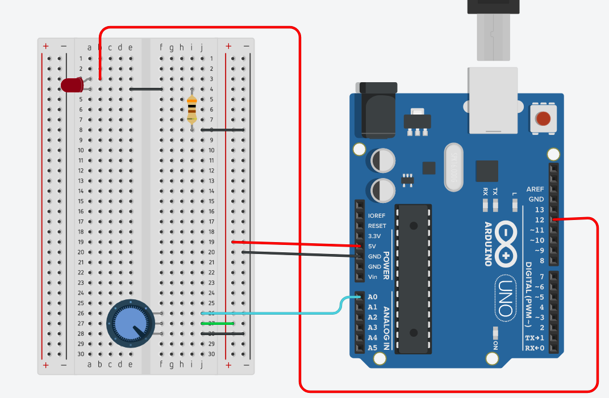

<h1 align="center">Aprendendo Arduino</h1>
<p>
  <a href="#" target="_blank">
    
  </a>
  <a href="https://twitter.com/marcelxsilva" target="_blank">
    
  </a>
</p>

> ## Controlando Intensidade do LED

Esta técnica é conhecida por Dimmer, que consiste basicamente em controlar a corrent elétrica que é transportada até uma lampada ou LED, sabemos que portas digitais possuem dois estados 0v e 5v, isso significa que elas não podem trabalhar como as portas analógicas que geram pulsos variados. Para que possamos obter esse recurso em uma porta digital utilizamos um recurso chamado, PWM(Pulse width modulation).

#### PWM
Consiste em pulsar rapidamente um sinal digital em um condutor, além de várias outras aplicações, esta técnica de modulação pode ser utilziada para simular uma tensão estática variável e é frequentemente aplicada no controle de motores elétricos, basicamente o PWM emite pulsos elétricos em uma velocidade extremamente rapida onde parece que o brilho de um LED, esta baixo.


Primeiro vamos criar um circuito onde podemos aumentar o periodo em que um LED fica ligado, fazendo com que ele pisque e em seguida vamos fazer outro circuito para controlar a intensidade do raio de Luz.

### Materiais
- Arduino
- Protoboard
- Potenciômetro
- Resistor 300Ω
- Jumpers

#### Circuito


```C++
const int potenciometro = A0;
const int LED = 12;

int variacao = 1023;
int resultado;
int reader;

void setup(){
  pinMode(potenciometro, INPUT);
  pinMode(LED, OUTPUT);
}
void loop(){
  reader = analogRead(potenciometro);
  resultado = variacao - reader;
  digitalWrite(LED, HIGH);
  delay(resultado);
  digitalWrite(LED, LOW);
  delay(resultado);
}
```

Para quem entende o código ja esta auto-explicativo, o ponto chave aqui é que o delay é o valor baseado no que se é lido do potenciometro, então se o valor for baixo o LED piscará mais rapido pois o delay está com o valor baixo.

Agora vamos controlar a intensidade de luz do nosso LED

o Circuito permanece o mesmo, a unica diferença é que iremos mudar o LED do pino 12 para o pino 11 que é um dos pinos dedicados a PWM.

### Código
```C++
const int potenciometro = A0; 
const int LED = 11; 
int reader = 0; 
int pwm = 0; 

void setup() {
  pinMode(potenciometro, INPUT);
  pinMode(LED, OUTPUT); 
}

void loop() {
  reader = analogRead(potenciometro);
  pwm = map(reader, 0, 1023, 0, 255); 
  analogWrite(LED, pwm);
  
}
```
Existe um código que não vimos antes, que é:
```C++
  pwm = map(reader, 0, 1023, 0, 255); 
```

Aqui, estamos dizendo que a variavel pwm receberá valores mapeados, onde <code>map(valor_lido, minimo_potenciometro, maximo_potenciometro, novo_minimo, novo_maximo) </code> então o valor da variável irá variar de 0 a 255, conforme o potenciômetro varia de 0 a 1023.

Então o resultado desse experimento é que será possivel controlar a intensidade da luz do led, como baixa ou alta.

<hr/>

## Author

 **Marcelo Silva**

* Twitter: [@marcelxsilva](https://twitter.com/marcelxsilva)

