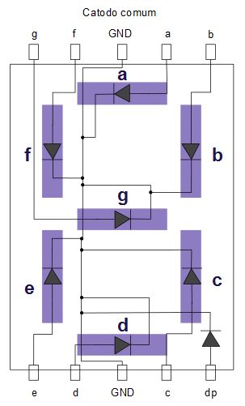
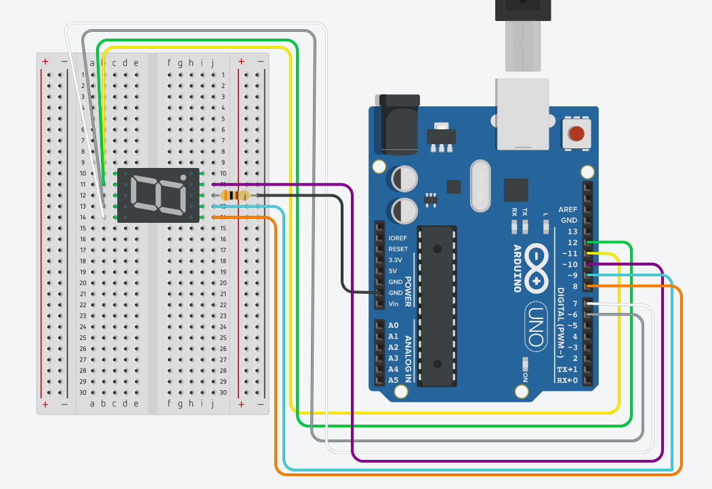

<h1 align="center">Aprendendo Arduino</h1>

  
  

> ## Brincando com Display

Desta vez iremos trabalhar com display, este tipo de dispositivo é muito utilizado para exibir informações para usuários, é utilizado também como contadores em alguns casos.

O display de 7 segmentos é composto por 8 LEDS, ligados com um ponto em comum que como podemos ver na imagem abaixo este ponto é o GND.

### Materiais
 - Arduino
 - Display de 7 Segmentos
 - Resistor 300Ω
 - Protoboard
 - Jumpers

## Circuito

Tendo em mente que o display é constituido por 8 LEDs, podemos entender melhor todo o seu funcionamento, pois tempos o pino GND que esta interligado com todos os LEDs interno e a tensão responsavel por ligar estes Leds é passado por cada porta do arduino.

[Aqui esta o Código](./DISPLAY_SEGMENTOS.ino) é um código relativamente grande, porém simples, que faz a contagem até 5, notando o código é possivel ver melhor como podemos trabalhar com nosso display, para acender nossos LEDs fizemos da mesma forma que fizemos nos passos anteriores.

---
 **Author - Marcelo Silva**

* Twitter: [@marcelxsilva](https://twitter.com/marcelxsilva)

