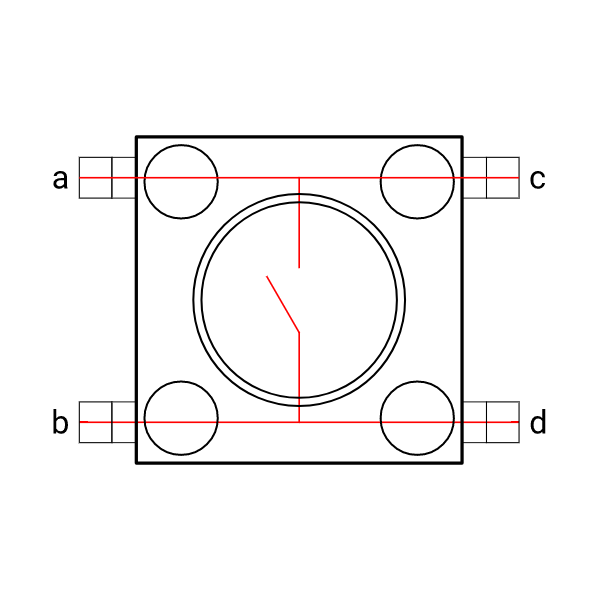

<h1 align="center">Aprendendo Arduino</h1>
<p>
  <a href="#" target="_blank">
    
  </a>
  <a href="https://twitter.com/marcelxsilva" target="_blank">
    
  </a>
</p>

> <h2>Ligando um LED ao Pressionar um Botão</h2>


Sabemos que os pinos do arduino funcionam como saida digital, onde a energia flui por eles até a carga. porém eles também podem ser configurados para permitir que a energia flua de fora para dentro, dessa forma podemos avaliar uma tensão de entrada como 0V ou 5V.

### Hardware

Irei utilizar o seguinte botão para controlar o estado do LED, (Ligado, Desligado). 

 


Este botão possui o seguintes terminais que são interligados aos pares, 
( Terminal a com c e b com d), pressionando o botão ira gerar uma continuidade de tensão e podemos utilizar este tipo de funcionamento para controlar o estado do LED.



### Materiais
- Placa arduino
- LED 5mm
- Chave MOmentânea (Botão)
- Resistor 10kΩ
- Resistor 300Ω
- Protoboard
- Jumpers


### Circuito
Abaixo esta o esquema do circuito:


Código do circuito:
```C
void setup()
{
  // Definindo pino 12 como saida
  pinMode(12,OUTPUT);
  // Definindo pino 9 como entrada
  pinMode(9, INPUT);
}

void loop()
{
  // Aqui temos uma condição, caso o pino 9 receber algum sinal ele manda sinal para o pinoo 12
  if(digitalRead(9) == HIGH){
  	digitalWrite(12, HIGH);
  }else {
  	digitalWrite(12, LOW);
  }
}
```
### Explicando

#### pinMode
O comando <code> pinMode</code> serve para definir qual será a finalidade de determinado pino do arduino, como no exemplo defimos o pino 12 como saida <code>pinMode(12,OUTPUT) </code> e o pino 9 como entrada <code>pinMode(9, INPUT) </code>.

#### digitalRead 
Temos uma estrutura condicional onde é feito a leitura do pino 9 pelo comando <code> digitalRead</code> este comando serve para ler o pino, que esta definido como o pino 9, o valor que este método retornará sera 5V que é a voltagem que utilizamos.

#### HIGH e LOW
Para definimos o estado do LED, como ligado e desligado utilizamos estes valores (HIGH,  LOW), que respectivimante significam ligado e desligado.

#### digitalWrite
Serve para enviar ou "Escrever valores", este comando esta definindo a porta no nosso LED como ligada ou desligada, então quando o botão for pressionado e enviar um sinal para a porta 9 e esta tiver o valor HIGH, então então enviaremos um sinal para o nosso LED ligar, caso contrario o LED estara desligado.


[Voltar ao Início](../README.md)
<hr/>
 
 **Author - Marcelo Silva**

* Twitter: [@marcelxsilva](https://twitter.com/marcelxsilva)
* Github: [@marcelxsilva](https://github.com/marcelxsilva)
