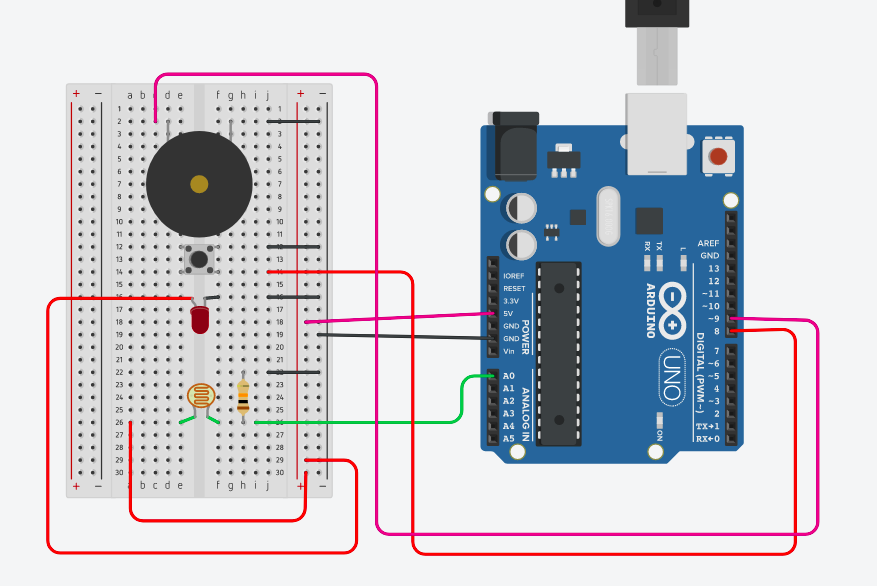

<h1 align="center">Aprendendo Arduino</h1>
<p>
  <a href="#" target="_blank">
    
  </a>
  <a href="https://twitter.com/marcelxsilva" target="_blank">
    
  </a>
</p>

> <h2>Sistema de Segurança com Laser</h2>

Quantas vezes voce assistiu um filme e viu essa cena:


Sempre achei incrível, e pensei por que não fazer um bem simples com arduino.

Vamos utilizar alguns componentes utilizados no passo anterior [Sensor de Luminosidade](../LIGHT_SENSOR/LIGHT_SENSOR.md)

Então o funcionamento dele será bem simples, iremos utilizar um LDR e emitir um raio de luz sobre ele vindo do Diodo Laser, e quando houver um objeto ofuscando a luz sobre o LDR, como dito em [Sensor de Luminosidade](../LIGHT_SENSOR/LIGHT_SENSOR.md) quando a intencidade de luz é pouca a sua resistencia aumenta que ira fazer com que o Buzzer emita um som de alerta.

#### Materiais
- Arduino
- [Diodo Laser 5V](https://www.robocore.net/loja/itens-eletronicos/diodo-laser-5v)
- Resistor 10kΩ
- [Sensor de Luminosidade](https://www.robocore.net/loja/sensores/sensor-de-luminosidade-ldr-5mm)
- Protoboard
- [Buzzer](https://www.robocore.net/loja/itens-eletronicos/buzzer-5v-ativo)
- Jumpers

#### Circuito



Obs: no exemplo do circuito utilizei um LED, por não possuir como exemplo um Diodo Laser.

#### Código 

```C
const int LDR = A0;
const int buzzer = 9;
const int button = 8; 

int readLDR = 0;
int readButton;

void setup() {
  pinMode(LDR, INPUT);
  pinMode(buzzer, OUTPUT);
  pinMode(button, INPUT_PULLUP);
}

void loop() {
  readLDR = analogRead(LDR);
  readButton = digitalRead(button);
  
  if (readLDR <= 512) {
  	tone(buzzer, 1000); 
  }
  else if (readButton == LOW) { 
  	noTone(buzzer); 
  }
}
```
#### Explicando código
Não irei explicar em detalhes pois já havia descrevido anteriormente.

Primeiramente definimos as variaveis
```C
const int LDR = A0;
const int buzzer = 9;
const int button = 8; 
```

Aqui estamos definindo as funções dos pinos
```C
    void setup() {
    pinMode(LDR, INPUT);
    pinMode(buzzer, OUTPUT);
    pinMode(button, INPUT_PULLUP);
}
```

Dentro do bloco de código loop:
```C
void loop() {
  readLDR = analogRead(LDR);
  readButton = digitalRead(button);
  
  if (readLDR <= 512) {
  	tone(buzzer, 1000); 
  }
  else if (readButton == LOW) { 
  	noTone(buzzer); 
  }
}
```
Aqui o código esta lendo o LDR <code>readLDR = analogRead(LDR)</code> e o Botão <code>readButton = digitalRead(button)</code>, caso o valor do LDR for menor que 512 ele acionará o Buzzer <code>tone(buzzer, 1000)</code>, e logo abaixo quando o Botão for pressionado o Buzzer irá parar de emitir som <code>noTone(buzzer)</code>.

É claro que esse projeto pode ser melhorado, podendo adicionar um LED, para acender uma luz.


[Voltar ao Início](../README.md)
<hr/>
 
 **Author - Marcelo Silva**

* Twitter: [@marcelxsilva](https://twitter.com/marcelxsilva)
* Github: [@marcelxsilva](https://github.com/marcelxsilva)
