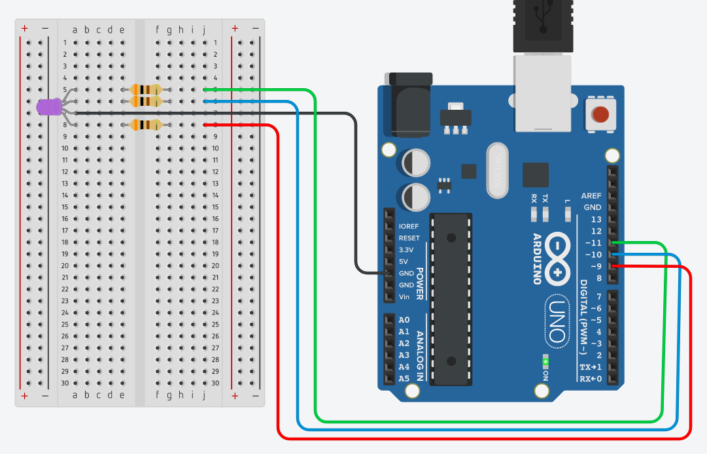

<h1 align="center">Aprendendo Arduino</h1>
<p>
  <a href="#" target="_blank">
    
  </a>
  <a href="https://twitter.com/marcelxsilva" target="_blank">
    
  </a>
</p>

> ## Brincando com LED RGB 

LED RGB é um conjunto de três LEDs encapsulados, cada um com uma cor distinta: vermelho, verde e azul. Com a união de todas essas cores podemos obter diversas cores.

Eletronicamente, cada cor varia a sua intensidade em uma escala de 0 a 255, como vimos no passo anterior [Controlando Intensidade do LED](../DIMMER_LED/DIMMER_LED.md), quando combinamos as três cores, é possivel formar cerca de 16 milhões de cores diferentes.

Quando utilizamos LEDs que possuiam dois pinos, em um deles passamos uma corrente de 5 v e o outro ligamos no pino GND do arduino, dessa vez não vai ser diferente, a unica direfença de LED RGB para os outros são a quantidade de pinos.

LEDs RGB possuem 4 pinos, 1(Vermelho), 2(Cátodo), 3(Verde) e 4(Azul), o Cátodo é um pino que depende da polarização, ou seja devemos liga-lo no pino GND do arduino, e os demais nos respectivos pinos do arduino que serão responsaveis por ligar e desligar o LED, como possui 3 tipos de cores, cada cor é independente, ou seja podemos ligar apenas a cor azul ou a vermelha, e ligando todas as cores em intensidades diferentes podemos formar cores distintas, vamos ao código.

### Materiais
- Arduino
- Protoboard
- LED RGB
- 3 Resistor 300Ω

### Circuito


<hr/>

É um exemplo simples, podemos ver que cada pino do LED esta indo em portas distintas no arduino e no código podemos mandar intensidades diferentes para cada pino onde emitirá cores diferentes, vamos ver um exemplo:

```C++
const int pinoLEDR = 11;
const int pinoLEDG = 10;
const int pinoLEDB = 9;

void setup()
{
  pinMode(pinoLEDR,OUTPUT);
  pinMode(pinoLEDG,OUTPUT);
  pinMode(pinoLEDB,OUTPUT);
}

void loop()
{
  analogWrite(pinoLEDR, 10);
  analogWrite(pinoLEDG, 69);
  analogWrite(pinoLEDB, 19);
}

```
Como aprendido nos passos anteriores definimos as variáveis e setamos elas como saida, logo abaixo temos o <code>analogWrite</code> que como vimos no passo anterior podemos utilizar este comando para fazer uma escrita analógica utilizando os pinos PWM do arduino, que são os pinos que possuem o (~)"til".

E os valores setados nesse métodos são para controlar o tipo de cor que queremos, voce pode consultar [esta tabela para pegar alguns valores](https://celke.com.br/artigo/tabela-de-cores-html-nome-hexadecimal-rgb).

Podemos melhorar nosso projeto adicionando botões que ao ser pressionados ligam cada cor do LED.

Um exemplo:


<hr/>

## Author

 **Marcelo Silva**

* Twitter: [@marcelxsilva](https://twitter.com/marcelxsilva)

