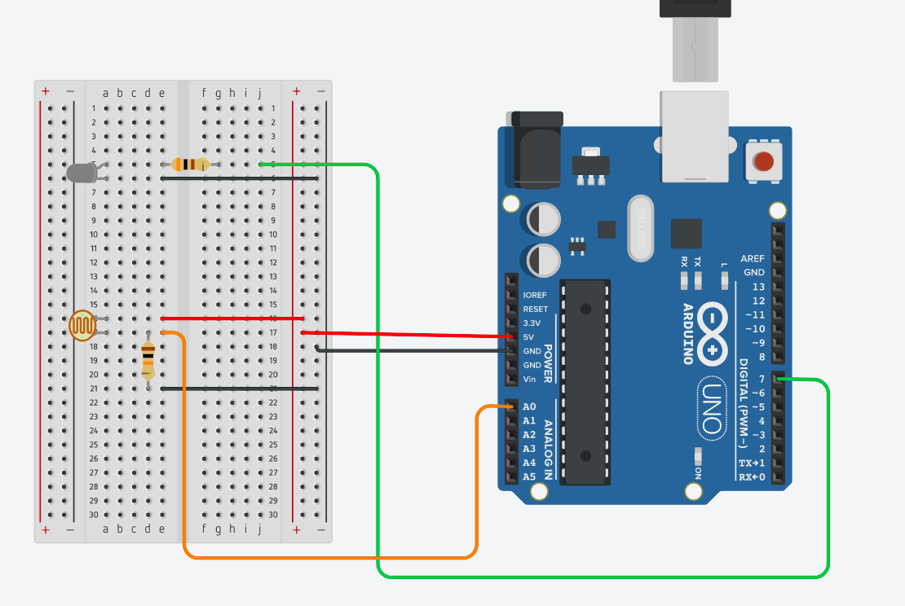

# Sensor de Luminosidade

Aqui irei fazer um projeto semelhante aos poste de energia publica, que durante o dia com a existencia da luz do sol se mantém apagada e ao anoitecer se acende para iluminar a via.

#### Materiais
- Placa arduino
- Protoboard
- Sensor de Luminosidade
- Resistor 10kΩ
- Resistor 300Ω
- LED 
- Jumpers

<code>Sensor de Luminosidade</code> é um sensor que varia sua resistencia de acordo com a intensidade de luz sobre ele, quando possui uma grande intensidade de luz sobre ele sua resistencia é baixa e quando possui pouca intensidade de luz sua resistencia aumenta.

#### Circuito



#### Código
```C
const int LDR = A0; 
int read = 0; 
float tensao = 0.0; 
const int LED = 7;

void setup() {
  Serial.begin(9600); 
  pinMode(LDR, INPUT);
}

void loop() {
  read = analogRead(LDR);
  
  if(read < 400){
    digitalWrite(LED, HIGH);
  }else {
    digitalWrite(LED, LOW);
  }

  Serial.print("read: ");
  Serial.print(read);

  tensao = read * 5.0 / 1023.0;
  Serial.print("Tensão: ");
  Serial.print(tensao);
  Serial.print("V");
  Serial.println();
  
}
```
#### Explicando


As primeiras linhas são as definicoes de variaveis:
```C
    const int LDR = A0;
    int read = 0; 
    float tensao = 0.0; 
```
<code>cont int LDR = A0; </code> aqui estou declarando uma constante do tipo inteira, esta definida como inteira pois o valor da pinagem em que o sensor esta conectado não mudará.

<code>int read = 0;</code> armazenará o valor lido pelo pelo ADC, o tipo é inteiro pois o valor dele irá de 0 á 1023.

<code> float tensao = 0.0;  </code> será responsavél por armazenar o valor da tensão.

Um pouco mais a frente:

```C
void setup() {
  Serial.begin(9600); // 9600bps
  pinMode(LDR, INPUT); // pino A0
}
```
<code>Serial.begin</code> indicará que o arduina fara a escrita ou leitura de dados no mundo externo, que neste caso iremos enviar os valores lidos pelo arduino pelo LDR, e os 9600 trata-se da taxa de transferencia que os dados serão enviados, em computadores geralmente é utilizado este valor.

Agora vamos a parte do loop:

```C
void loop() {
  read = analogRead(LDR);
  
  if(read < 400){
    digitalWrite(LED, HIGH);
  }else {
    digitalWrite(LED, LOW);
  }

  Serial.print("read: ");
  Serial.print(read);

  tensao = read * 5.0 / 1023.0;
  Serial.print("Tensão: ");
  Serial.print(tensao);
  Serial.print("V");
  Serial.println();
  
}

```

<code> read = analogRead(LDR);</code> está fazendo a leitura do pino do LDR e armazenando na variavel que declaramos la em cima.

Em seguida temos uma estrutura condicional que verifica se o valor lido é menor que 400, se por acaso a tensidade de luminosidade for pouca um pouco a baixo temos o comando <code>digitalWrite(LED,HIGH); </code> que esta ligando nosso LED, e o else que caso a luminosidade subir seu valor ele desligará o LED.

Já os coódigos que estão um pouco abaixo não tem muito segredo, alguns imprime o valor obtido e este <code>tensao = read * 5.0 / 1023.0;</code> está fazendo uma soma para obter a tensão total.
