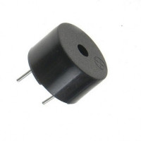
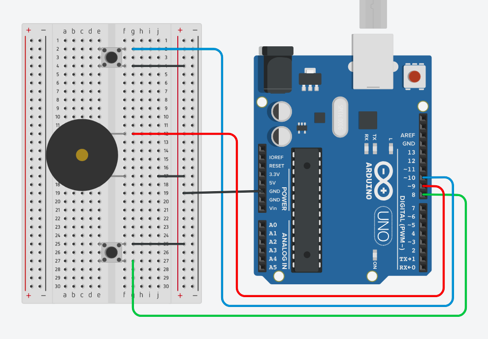

# FAZENDO UM POUCO DE BARULHO

Sinalizadores são utilizados em diversas areas, podendo desempenhar um grande papel em alguns projetos, como por exemplo sistemas de alarmes.

Neste projeto iremos utilizar um Buzzer, como mostrado na imagem:



#### Funcionamento
Vamos entender primeiramente como um Buzzer funciona, um buzzer é constituido por dois pinos que são ligado ao GND e 5 V. em seu interior possui um disco de cerâmica central, rodeado por um disco de vibração metalico, quando é aplicado corrente eletrica ao buzzer o disco de cerâmica é contraido ou expandido o que ocasiona no som que ouvimos.

#### Materiais 
- Arduino
- Protoboard
- 2 Chaves Momentânea
- Buzzer
- Alguns Jumpers


#### Circuito


Podemos ver no circuito que existe um buzzer e duas chaves momentânea(botoes), estes botoes ira controlar a frequencia do barulho que o buzzer emitirá, então em dado momento o buzzer emitirá um sinal agudo e outro mais grave e tudo isso é controlado pelos dois botoes, pressionando um botão o som se torna aguda, pressionando o outro o botão se torna mais grave, abaixo temos o código e em seguida a explicação do seu funcionamento.


```C
int frequencia = 2000; // frequencia inicial do buzzer
const int pinoBuzzer = 9; // pino onde o buzzer esta conectado
const int pinoBotao1 = 10; // pino onde o botao 1 esta conectado
const int pinoBotao2 = 8; // pino onde o botao 2 esta conectado

void setup(){
  pinMode(pinoBuzzer, OUTPUT); // configura o pino com o buzzer como saída
  pinMode(pinoBotao1, INPUT_PULLUP); // configura o pino com o Botão como entrada
  pinMode(pinoBotao2, INPUT_PULLUP); // configura o pino com o Botão como entrada
}

void loop(){

  // Soma 100 à frequencia atual se o botao estiver pressionado
  if (digitalRead(pinoBotao1) == LOW) {
    frequencia = frequencia + 100;
  }
  
  // Subtrai 100 da frequencia atual se o botao estiver pressionado
  if (digitalRead(pinoBotao2) == LOW) {
    frequencia = frequencia - 100;
  }
  
  tone(pinoBuzzer, frequencia); // gera frequencia no buzzer
  delay(1000);
  noTone(pinoBuzzer); // para frequencia no buzzer
  delay(1000);
}
```

#### Explicando

Irei explicar somente os comandos novos, os quais não utilizamos ainda.

No inicio do código utilizamos variaveis para armazenar os pinos que estamos utilizando, dessa forma o código fica menos verboso e de facil manutençao.

##### INPUT_PULLUP 
Utilizamos essa instrução para além de definir o pino como entrada também estamos habilitando internamente no chip um resistor entre o pino e o VCC, para quando for pressionado o botão, não receberemos o valor HIGH mas sim o valor LOW, por este motivo é que na comparação temos if (digitalRead(pinoBotao2) == LOW).

#### tone
Serve para emitir uma frequencia que permitira que o buzzer emita barulho, não utilizamos digitalWrite pois nosso buzzer é do tipo passivo e deve existe uma oscilação para emitir o sinal.

#### noToner
Serve para desabilitar a frequencia ou melhor seria desligar o buzzer.

#### delay 
Este serve para aguardar determinado tempo em milissegundos para executar a próxima instrução.