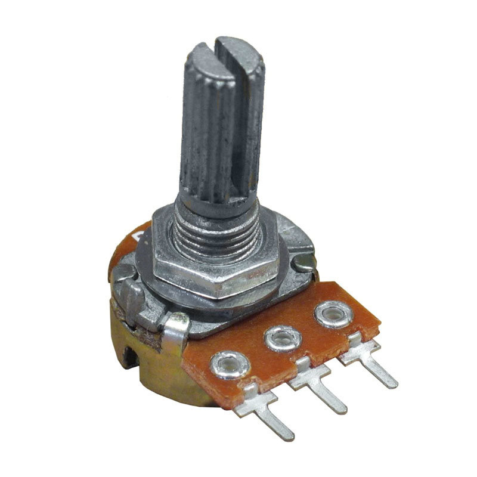
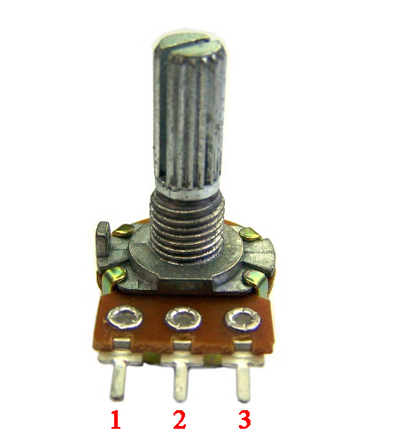
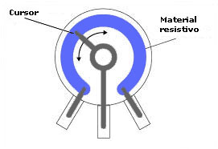
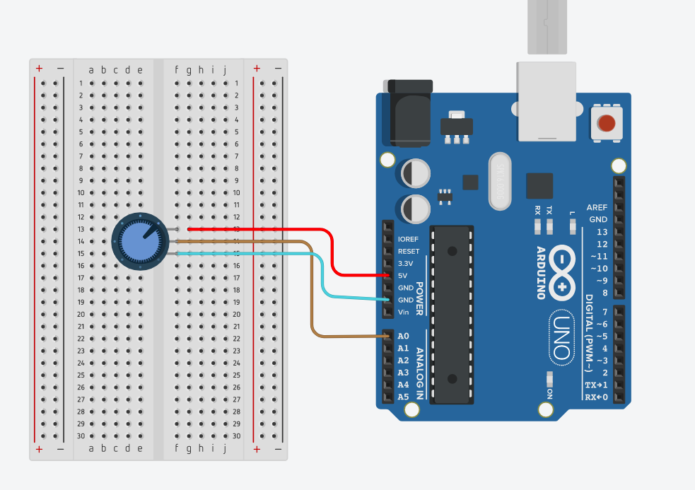
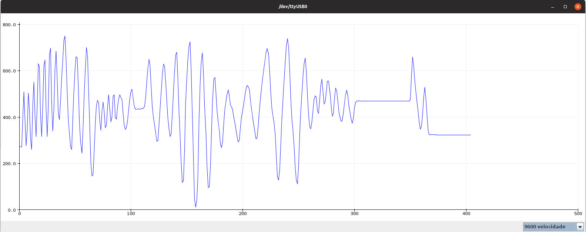

<h1 align="center">Aprendendo Arduino</h1>
<p>
  <a href="#" target="_blank">
    
  </a>
  <a href="https://twitter.com/marcelxsilva" target="_blank">
    
  </a>
</p>

> <h2>Trabalhando com Gráficos</h2>

Por vezes surge a necessidade de ilustrarmos determinados resultados de uma forma que seja de fácil compreensão, e não existe coisa mais simples que gráficos para nos ajudar nesta tarefa, neste projeto utilizei um pontenciômetro.



Tendo o funcionamento básico em limitar o fluxo de corrente elétrica em um circuito, a sua resistencia é medida em ohms, tendo um pontenciômetro de 10k ohms ([Aprenda Calcular ohms](https://www.mundodaeletrica.com.br/calculo-de-resistores-dicas-de-como-fazer/)), 10k ohms  é a sua resistência máxima e teóricamente ele pode variar sua resistencia um pouco mais de 0 á 10k ohms [Saiba mais](http://www.bosontreinamentos.com.br/eletronica/curso-de-eletronica/como-funciona-um-potenciometro/).


#### Pontenciômetro
Normalmente encontrado em aparelhos de som para ajustar o volume, é composto por três pinos e possui resistência ajustável podemos caracteriza-lo como um divisor de tensão

Como dito acima o pontenciômetro possui três pinos, (1) VCC, (2) GND e (3) OUT, como na imagem abaixo: 




Em relação ao esquema de ligação dos pinos não importa muito pois como mostra na imagem o interior de um pontenciômetro representado pela cor roxa o pino VCC se conecta com OUT, alterando apenas a direção de rotação.

Então vamos lá, farei a leitura de um potenciômetro e exibirei os dados na Portal Serial da IDE do arduino.

### Materiais
- Arduino
- Protoboard
- Potenciômetro 10kΩ
- Jumpers


### Circuito


### Código
```C
int PIN = A0;
float readResult;

void setup() {
  pinMode(PIN, INPUT);
  Serial.begin(9600);
}
void loop() {
  readResult = analogRead(PIN);
  Serial.println(readResult);
  delay(100);        
}
```

### Explicando o Código

Todos esses comandos ja foram utilizados em outros projetos desse repositório, irei explicar sobre cada um deles novamente, <code>Serial.begin(9600);</code> configura a taxa de entre o arduino e o computador, <code>Serial.print();</code> imprime o valor no Serial da IDE.

Vale lembrar que para visualizar os valores enviados para o computador pelo arduino é necessario ir até o A aba superior do arduino, clicar em <code>Ferramentas</code> e selecionar a opção <code> Serial monitor</code> E serÁ exibido: 


Esse é o valor que o potenciomêtro está enviando ao computador, e como nosso objetivo é exibir um gráfico, basta fechar o Monitor serial, e realizando o mesmo procedimento que voce realizou para abri-lo, só que dessa vez selecione <code> Plotter Serial</code>, girando o potenciomêtro em ambas as direções será exibido o nosso gráfico:





[Voltar ao Início](../README.md)
<hr/>
 
 **Author - Marcelo Silva**

* Twitter: [@marcelxsilva](https://twitter.com/marcelxsilva)
* Github: [@marcelxsilva](https://github.com/marcelxsilva)

